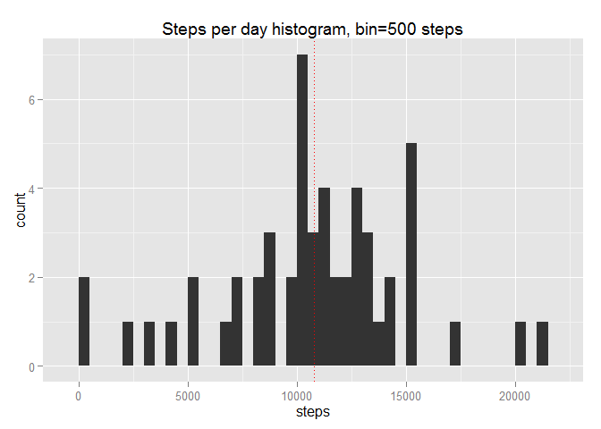
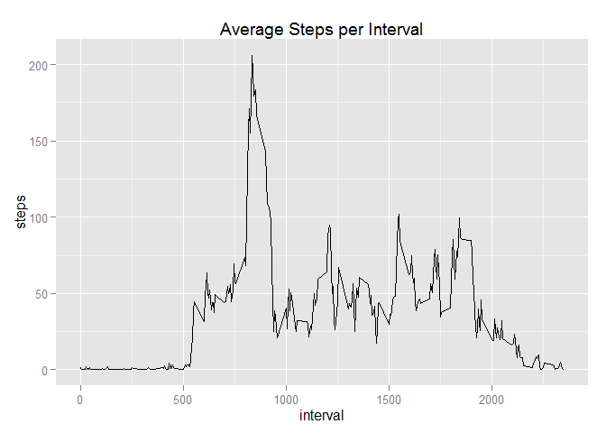
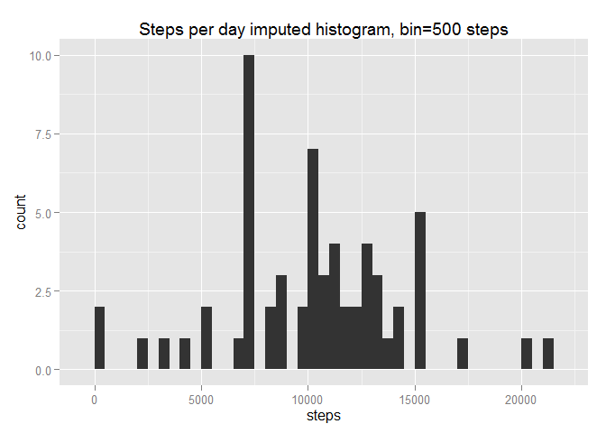
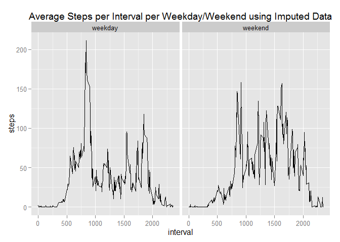

# Reproducible Research: Peer Assessment 1

This project aims to analyze fitness step data using knitr as a medium to share the process and results.

(note: this is a resubmission to the course - i previously did not complete peer assessment 2)


## Loading and preprocessing the data

*We will use ggplot2 for constructing plots*


```r
library(ggplot2)
```

```
## Warning: package 'ggplot2' was built under R version 3.1.3
```

*The activity zip file has been unzipped to activity.csv in the working directory.*


```r
activityData<-read.csv("activity.csv")
```


## What is mean total number of steps taken per day?

Calculate the total number of steps taken per day


```r
stepsPerDay<-aggregate(steps ~ date, data = activityData, sum)
```

Calculate and report the mean and median of the total number of steps taken per day


```r
meanStepsPerDay<-round(mean(stepsPerDay$steps, na.rm = TRUE), digits=2)
```

*The mean steps per day is 1.076619\times 10^{4}*


```r
medianStepsPerDay<-median(stepsPerDay$steps, na.rm = TRUE)
```

*The median steps per day is 10765*

Make a histogram of the total number of steps taken each day


```r
stepsPerDayHist <- ggplot(stepsPerDay,aes(x = steps)) +
                   geom_histogram(binwidth = 500) +
                   ggtitle("Steps per day histogram, bin=500 steps") +
                   geom_vline(xintercept=meanStepsPerDay, linetype="dotted", color="red")

stepsPerDayHist
```

 

## What is the average daily activity pattern?

Make a time series plot (i.e. type = "l") of the 5-minute interval (x-axis) and the average number of steps taken, averaged across all days (y-axis)


```r
stepsPerInterval<-aggregate(steps ~ interval, data = activityData, mean)

stepsPerIntervalLine <- ggplot(stepsPerInterval,aes(interval, steps)) +
                   geom_line() +
                   ggtitle("Average Steps per Interval")

stepsPerIntervalLine
```

 

Which 5-minute interval, on average across all the days in the dataset, contains the maximum number of steps?


```r
maxSteps<-stepsPerInterval[which.max(stepsPerInterval$steps),"interval"]
```

*The interval containing the max amount of average steps is 835*


## Imputing missing values

Calculate and report the total number of missing values in the dataset (i.e. the total number of rows with NAs)


```r
summary(activityData)
```

```
##      steps                date          interval     
##  Min.   :  0.00   2012-10-01:  288   Min.   :   0.0  
##  1st Qu.:  0.00   2012-10-02:  288   1st Qu.: 588.8  
##  Median :  0.00   2012-10-03:  288   Median :1177.5  
##  Mean   : 37.38   2012-10-04:  288   Mean   :1177.5  
##  3rd Qu.: 12.00   2012-10-05:  288   3rd Qu.:1766.2  
##  Max.   :806.00   2012-10-06:  288   Max.   :2355.0  
##  NA's   :2304     (Other)   :15840
```

*There are 2304 NA's in the data.*

Devise a strategy for filling in all of the missing values in the dataset. The strategy does not need to be sophisticated. For example, you could use the mean/median for that day, or the mean for that 5-minute interval, etc.

*I will naively choose the to impute missing values using the mean average of the interval across all days.  This will probably have an effect of reducing the standard deviation of the data set.*

Create a new dataset that is equal to the original dataset but with the missing data filled in.


```r
imputedActivityData<-activityData
activityDataIsNA<-is.na(activityData$steps)

counter<-1

for (i in activityDataIsNA){
  if(i == TRUE){
    imputedActivityData$steps[counter]<-stepsPerInterval$steps[as.numeric(imputedActivityData$interval[counter])/5+1]
  }
  counter<-counter+1
}
```

Make a histogram of the total number of steps taken each day and Calculate and report the mean and median total number of steps taken per day. Do these values differ from the estimates from the first part of the assignment? What is the impact of imputing missing data on the estimates of the total daily number of steps?


```r
stepsPerDayImputed<-aggregate(steps ~ date, data = imputedActivityData, sum)


stepsPerDayImputedHist <- ggplot(stepsPerDayImputed, aes(x = steps)) +
                   geom_histogram(binwidth = 500) +
                   ggtitle("Steps per day imputed histogram, bin=500 steps")

stepsPerDayImputedHist
```

 

Calculate and report the mean and median of the total number of steps taken per day


```r
meanImputedStepsPerDay<-round(mean(stepsPerDayImputed$steps, na.rm = TRUE), digits=2)
```

*The mean steps per day with imputation is 1.028214\times 10^{4}*


```r
medianImputedStepsPerDay<-median(stepsPerDayImputed$steps, na.rm = TRUE)
```

*The median steps per day with imputation is 1.0395\times 10^{4}*

*Both mean and median total steps have decreased, daily total estimates of steps has decreased.  This doesn't seem to be intuitively correct. perhaps there is a bug in my code logic*


## Are there differences in activity patterns between weekdays and weekends?

Create a new factor variable in the dataset with two levels - "weekday" and "weekend" indicating whether a given date is a weekday or weekend day.


```r
dateCounter<-1
dayTypeList<-NULL

for (j in activityDataIsNA){
  day<-weekdays(as.Date(imputedActivityData$date[dateCounter]))
  
  if(day %in% c("Saturday","Sunday")){
    dayTypeList<-c(dayTypeList,"weekend")
  }else{
    dayTypeList<-c(dayTypeList,"weekday")
  }

  dateCounter<-dateCounter + 1
}

imputedActivityData$dayType<-factor(dayTypeList)
levels(imputedActivityData$dayType)
```

```
## [1] "weekday" "weekend"
```
  
Make a panel plot containing a time series plot (i.e. type = "l") of the 5-minute interval (x-axis) and the average number of steps taken, averaged across all weekday days or weekend days (y-axis). See the README file in the GitHub repository to see an example of what this plot should look like using simulated data.


```r
stepsPerIntervalImputed<-aggregate(steps ~ interval + dayType, data = imputedActivityData, mean)

stepsPerIntervalLineImputedPanel <- ggplot(stepsPerIntervalImputed,aes(interval, steps)) +
                   geom_line() +
                   ggtitle("Average Steps per Interval per Weekday/Weekend using Imputed Data") +
                   facet_grid(facets=(. ~ dayType))

stepsPerIntervalLineImputedPanel
```

 

